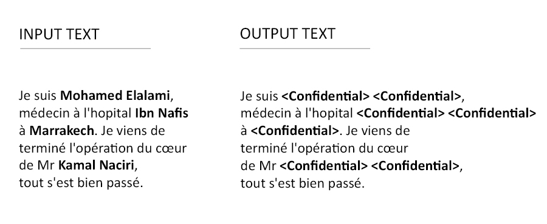

# Name-Anonymizer for data protection (beta)

## What is Name-Anonymizer ?

Name Anonymizer is a simple tool that detects and hides foreign words (could be names, locations...) in text. 
***Best use: French text with non-French names.***

## How to use it ?

Clone the repository and run the following command:

<code>python main.py input_directory output_directory</code> 

<code>input_directory</code> : path to the directory containing text files to anonymize (make sure it contains only readable files)

<code>output_directory</code> : path to the directory of anonymized text files.
